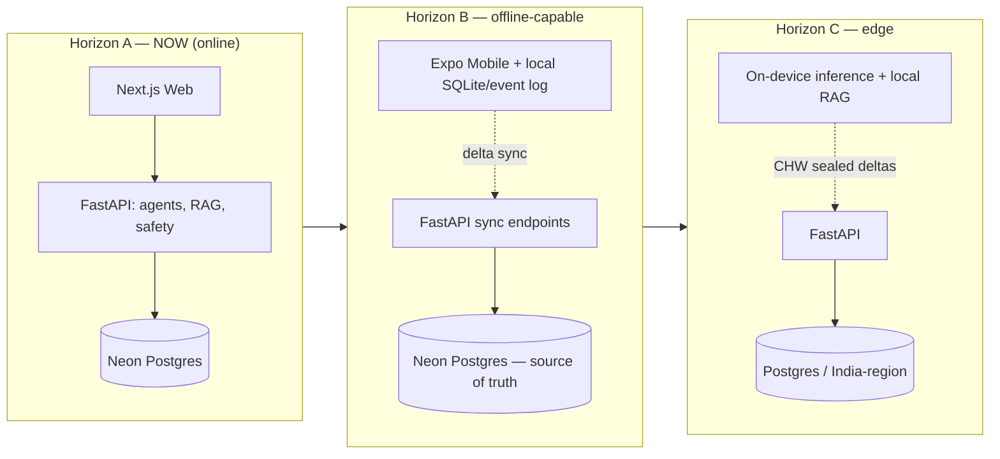
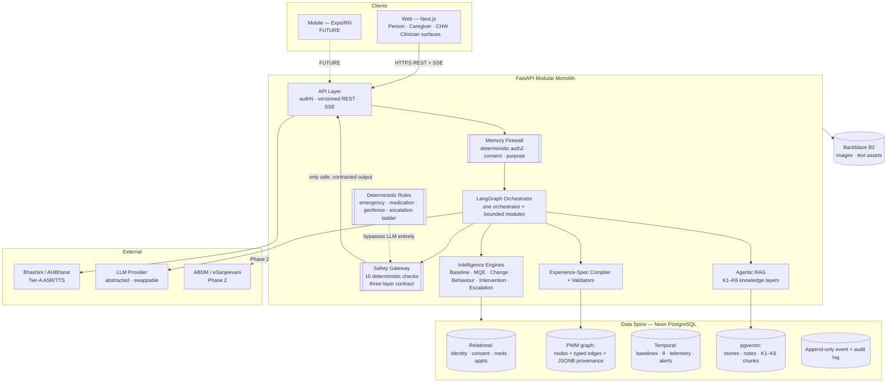
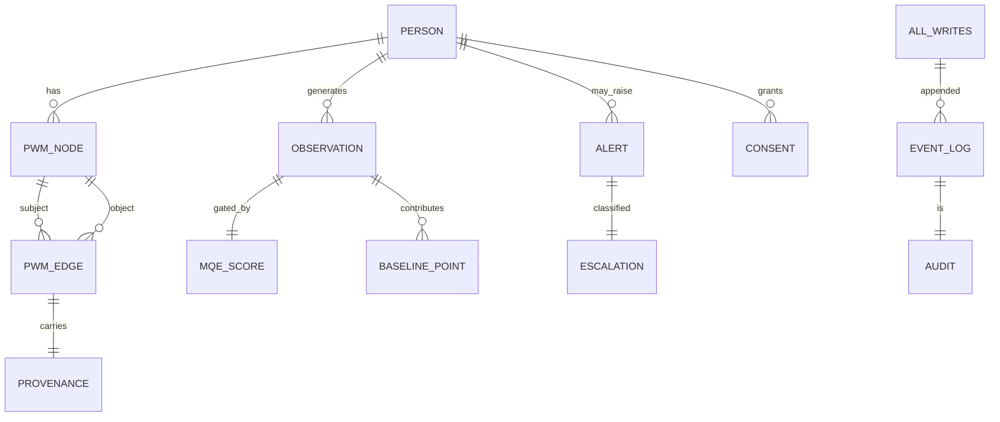
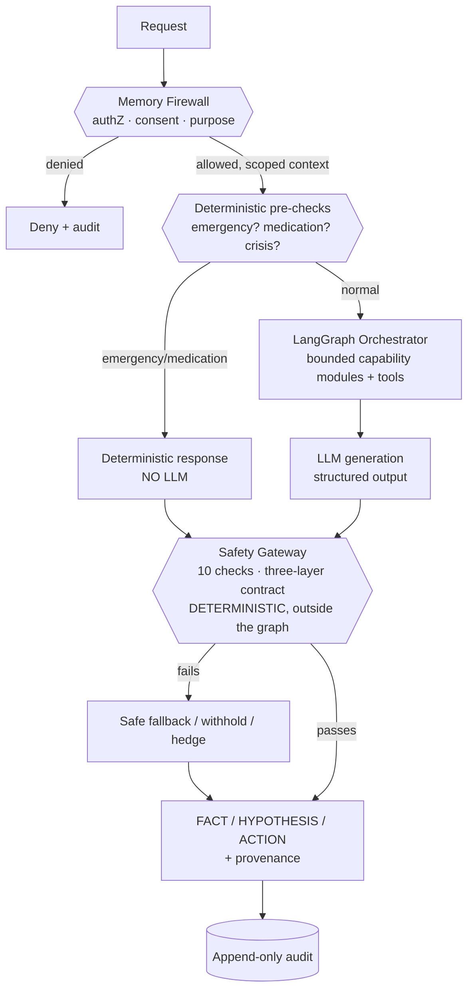
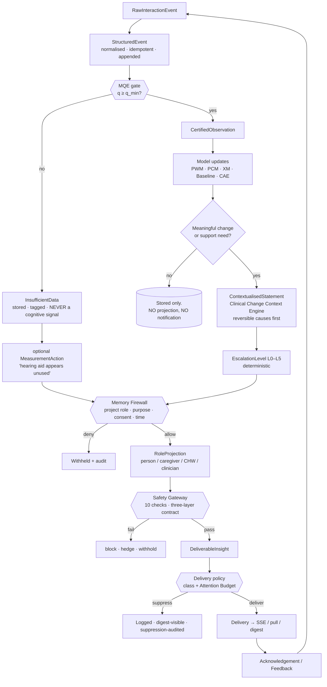
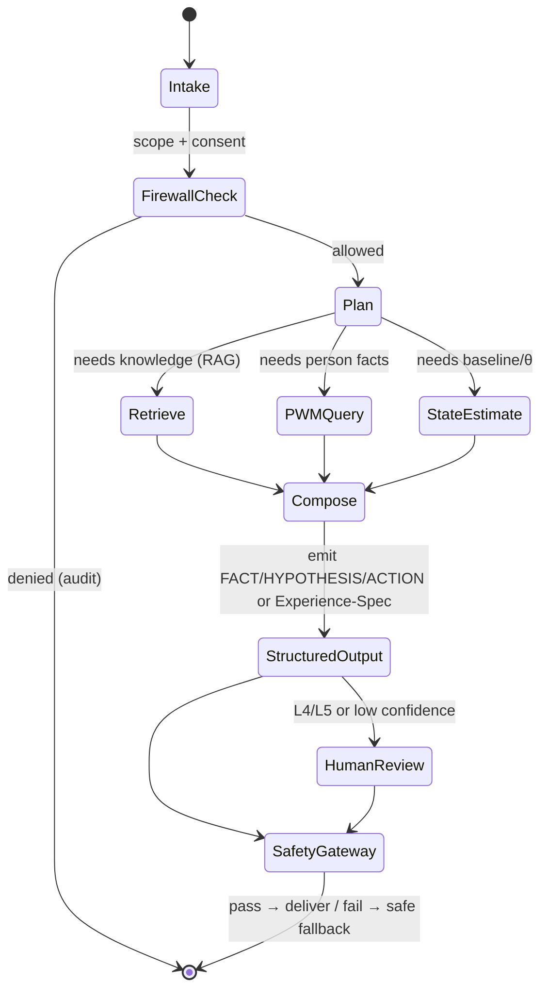
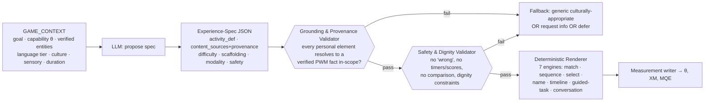
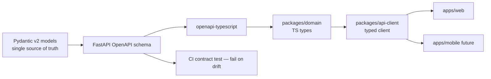

# MindMitra — Technical Architecture & Technology Selection Reference

**Problem Statement:** SIH 2026 · PS26003 — AI-Based Cognitive Gaming and Memory Assistance Platform for Elderly Dementia Patients in the North Eastern Region (MDoNER).
**Status:** Architecture baseline for first production implementation.
**Document type:** Engineering decision document. Every technology named carries a reason, a trigger for when to introduce it, and a trigger for when it becomes unnecessary. This is meant to be actioned by a developer or an AI coding agent.

> **Governing product rule (never violated by any technical choice):**
> *AI detects, retrieves, summarises, personalises, prioritises and assists. Clinicians diagnose, prescribe and decide. The person and family retain agency.*

---

## 1. Executive Summary

MindMitra is **not a games app**. It is a *shared intelligence layer* between a person losing their internal model of the world, a family becoming that model by force, a CHW who is the only regular clinical contact for a hundred kilometres, and a clinician with fifteen minutes and no history. The technology must therefore optimise for **trustworthy intelligence under strict safety constraints**, not for feature count.

The recommended stack:

- **One monorepo** (Turborepo + pnpm for JS/TS; `uv` for Python) holding a **first-class Next.js web app now**, a **future Expo (React Native) mobile app**, and **shared TypeScript domain packages**.
- **A dedicated production web client (Next.js + React + TypeScript)** — *not* a React-Native-Web-unified web surface. This is the one place I diverge from the proposed stack, and §7 defends it in full. React Native + Expo remains the committed **mobile** direction, sharing everything except the render layer.
- **FastAPI (Python) modular monolith** for APIs, agentic orchestration, RAG, cognitive-state math, and safety enforcement — with an **OpenAPI → TypeScript type-generation pipeline** as the Python↔TS contract backbone.
- **A PostgreSQL-centric data spine on Neon**, using relational tables + JSONB + `pgvector` + append-only event/audit tables to represent the *entire* Personal World Model, cognitive state, provenance, consent, and memory — **no polyglot database at MVP**. Graph, temporal, and vector needs are all met inside Postgres until named thresholds are crossed (§9).
- **Backblaze B2** for image and text-associated assets (media scope is intentionally images + text; no video/audio pipeline).
- **LangGraph** for a **single bounded orchestrator + capability modules**, with the **deterministic Safety Gateway living OUTSIDE the LLM graph** as plain, un-bypassable Python. Emergency and medication paths never enter an LLM.
- **A hard four-way separation of intelligence** — deterministic rules vs. classical ML vs. LLM generation vs. agentic orchestration — defined precisely in §13.
- **A typed Evidence & Projection Pipeline (§13.2)** carrying one interaction from raw telemetry to four separately-authorised, separately-safety-gated role projections. This is the architectural answer to "one person, one model, four experiences", and it makes `game score → cognitive score → diagnosis` structurally impossible.
- **The Memory Firewall extended over derived information (§19.1)** — it authorises not only *data* but *insights, reports, notifications, exports and packets*, per role, purpose, time and consent.
- **A delivery-priority layer (§21.1)** orthogonal to the L0–L5 escalation ladder, whose job is to *reduce* interruption; `NO_NOTIFICATION` and "no action required" are first-class outputs.
- **Offline-first treated as an evolution, not a current constraint.** We build the *seams* now (event-sourced writes, idempotency, entity versioning, a sync-friendly API, provenance on every fact) so that Phases B and C (offline-capable → edge/on-device) require no rewrite.

Fixed infrastructure cost for the current stage is **effectively zero** on free tiers; the only real variable cost is hosted LLM inference, mitigated by model tiering and prompt minimisation (§32).

---

## 2. Architectural Principles

These are the invariants. Every later section is downstream of them.

1. **Human agency is enforced in code, not documented in prose.** The Memory Firewall, three-layer output contract, and Safety Gateway are deterministic modules that outputs *cannot* bypass.
2. **Deterministic safety sits outside the LLM.** No LLM decides an emergency, a medication action, an escalation level, or an access-control outcome. LLMs do language; rules do safety.
3. **Provenance on every fact.** Every stored assertion about a person carries source, confidence, verification status, validity interval, and visibility scope (§16). This is simultaneously the trust mechanism *and* the future sync/event foundation — one structure, two jobs.
4. **Postgres-first.** Reach for a specialised datastore only at a named, measured trigger. "The conceptual model mentions a graph" is not a trigger.
5. **Web is a first-class product now; mobile is first-class later.** Share domain logic, not the render layer. Never degrade the web experience to buy premature code reuse.
6. **Build the offline seams now, defer the offline engine.** Event log, idempotency, versioning, sync contract exist from day one; the client replica and edge inference come later.
7. **Defer until a trigger fires.** Every deferred technology (§34) has an explicit condition that would justify adopting it. No speculative infrastructure.
8. **Containerise for portability.** Avoid lock-in that would block eventual India-region / government-cloud / on-prem deployment (DPDP-2023, ABDM, MDoNER programme constraints).
9. **Bad data cannot raise an alarm.** The Measurement-Quality gate is a structural precondition to every inference, not a post-hoc filter.
10. **Research and production are separated by a one-way, governed data boundary.** No research model reaches production alerting before passing validation gates (the CAE ladder).
11. **One evidence base, four projections.** Never `raw event → LLM → everyone gets a report`. Always `raw event → deterministic/ML processing → governed evidence → role-specific projection → safety → delivery`. A projection is derived, authorised and audited per role; two projections of the same evidence may differ in detail and register but may never contradict each other.
12. **Delivery is a decision, not a side effect.** Producing an insight and interrupting a human are separate acts with separate policies. Silence is a designed outcome and is audited.

---

## 3. Current Development Priorities

In order:

1. **Production-grade web application** — the first-class, fully functional product surface demonstrating the complete intelligence of the platform.
2. **Fully functional backend + AI/agentic infrastructure** — real orchestration, RAG, PWM interaction, cognitive-state estimation, personalisation, safety, provenance, escalation.
3. **Clean shared domain contracts and typed APIs** — the seam that makes web + future mobile + research coherent.
4. **Future React Native + Expo mobile application** — architected-for now, built later.
5. **Progressive offline / edge capabilities** — seams now, engine later.

Explicit non-goals for the current stage: on-device inference, a client-side replica database, video/audio pipelines, polyglot datastores, microservices, wearables ingestion, federated learning. All are deferred with triggers (§34).

---

## 4. Current vs Future Architecture (A / B / C)

The user brief asks for a clean separation of three horizons. This framing governs the whole document.

| Horizon | Name | Connectivity assumption | What runs where | Status |
|---|---|---|---|---|
| **A** | **Current Internet-connected production/demo** | Reliable Internet | LLM, agents, RAG, cognitive-state math, safety, persistence all **server-side**; Next.js web client online | **Build now** |
| **B** | **Offline-capable architecture** | Intermittent | Client keeps a **local replica + append-only event log**; **delta sync** with conflict preservation; API already event-sourced, idempotent, versioned | **Design now, seams built now, engine later** |
| **C** | **Advanced offline / edge** | Frequently zero (1,841 NER villages) | **On-device inference** (quantised Indic models), local RAG, local baseline, geofence on-device, **CHW encrypted sync-mule** | **Future; no rewrite required to reach it** |

**The central insight that makes A→B→C non-destructive:** the audit/provenance requirements of Horizon A *already force* an append-only, event-sourced, provenance-stamped write model. That same model *is* the foundation of Horizon B's sync. We are not paying extra for offline-readiness — we are reusing the safety infrastructure we must build anyway.



---

## 5. High-Level System Architecture



The shape is **one orchestrator, bounded capability modules, a deterministic safety envelope, specialised tools, one data spine** — exactly the documents' mandate, and explicitly *not* a swarm of autonomous agents.

---

## 6. Frontend / Web Stack

The web app is the **first-class production client** and must not be compromised. The person-facing, caregiver, CHW, and clinician surfaces are largely data-dense, dashboard-style UIs (the clinician trajectory view with provenance, the caregiver daily card, the Studio authoring/QA views). These are DOM-and-CSS-native problems.

| Concern | Choice | Reasoning |
|---|---|---|
| Framework | **Next.js (App Router) + React 19 + TypeScript** | Public "six doors" site needs SSR/SEO (Appendix G); authenticated app benefits from React Server Components for data-dense dashboards; single project serves both; best-in-class free hosting (Vercel) with per-PR previews. |
| Styling | **Tailwind CSS + shadcn/ui (Radix primitives)** | Production quality + accessible-by-default (critical for elderly, low-literacy, high-contrast, large-tap-target constraints); design tokens live in a shared package. |
| Cross-platform token bridge | **Nativewind (later, for mobile)** | Lets the same Tailwind token vocabulary drive future RN styling — reuse tokens across web/mobile **without** forcing React-Native-Web on the web. |
| Server-state / data fetching | **TanStack Query** | Cache, retries, background refetch, and the natural place to later add offline persistence (IndexedDB persister) when Horizon B begins. |
| Local UI state | **Zustand** (+ React context for scoped trees) | Minimal, testable; no Redux ceremony. |
| Forms + validation | **React Hook Form + Zod** | Zod schemas are shared with the API contract (§38); one validation vocabulary end to end. |
| Routing | **Next.js App Router** (web); **Expo Router** (future mobile) | Deliberately *different* routers per platform — shared logic lives in packages, not routing. |
| Realtime | **SSE client** (EventSource) | One-way push for caregiver alerts / CHW sync status (§23). |
| Charts (clinician trajectory) | **Visx or Recharts** | Provenance-annotated trajectory lines, deviation bands — DOM/SVG, painful in RN-Web. |
| Accessibility | **WCAG 2.2 AA baseline, voice-first, picture-first** | ≥ font scaling, ≥ contrast, ≥ tap targets, screen-reader labels; Radix gives the a11y floor. |
| PWA | **Installable PWA + service worker (Horizon B onramp)** | Gives an *offline story on the web* later without RN; defer the service worker caching logic until Horizon B. |

**Design-system note:** `packages/ui-tokens` (colours, spacing, type scale, motion) is the single source of visual truth so the future Expo app inherits the same design language. **`DESIGN.md` is authoritative for how those tokens are used** — information architecture, the four role experiences, the report visual grammar, every UI state, and the anti-AI-slop rules. Read it before writing any component; do not improvise visual decisions.

**Navigation is generated, not authored.** Per §19.1.4, a role's navigation tree is derived from `Firewall.project()`. Do not build a static menu and hide items — an unauthorised route must not exist in the tree.

---

## 7. React Native + Expo Strategy — and why the *web* is not React-Native-Web

This is the most contestable decision in the brief, so it gets full treatment. You proposed React Native + Expo + TypeScript as the cross-platform direction and are considering a unified Expo/React-Native-Web surface for the web.

**Recommendation: dedicated Next.js web now + future Expo mobile, sharing TypeScript domain packages — not a unified RNW web surface.**

### 7.1 The three options

| Option | Description | Verdict |
|---|---|---|
| **A. Unified RNW** | One Expo codebase renders web + native via React Native Web | **Not recommended as the web surface** |
| **B. Dedicated web + dedicated mobile, shared non-UI packages** | Next.js web + Expo mobile; share types, API client, business logic, experience-runtime core, tokens | **Recommended** |
| **C. Unified with escape hatches** | RNW base + `.web.tsx`/`.native.tsx` overrides on divergent screens | Fallback if a single team truly must maintain one tree |

### 7.2 Why B, concretely

- **Your own priority ordering is "WEB FIRST."** You explicitly warned that choosing RN/Expo must *not* reduce web quality. RNW's web output ceiling is real: `View`/`Text` primitives, weaker SSR/SEO, weaker DOM accessibility, and painful data-dense layouts (charts, tables, the clinician dashboard). Honouring "web first" points to real DOM + CSS.
- **The surfaces are web-shaped.** Caregiver cards, clinician trajectory + provenance, Studio authoring/validation, the public six-door site — these are dashboard and content UIs where Next.js is far stronger.
- **You lose almost nothing.** Mobile UI is a *future* deliverable. Building web UI now in React, then native UI later in Expo, while **sharing the domain layer**, is *less* total work than fighting RNW's web ceiling now and its native quirks later.
- **The person-facing companion** (voice-first, big buttons, picture-first) is the one surface that maps cleanly to RN — and it's exactly the surface you'll want *native* (offline, on-device TTS/voice) on mobile anyway. A simple React version on web + a native Expo version later is the right split.

### 7.3 What is shared vs. per-platform

```
SHARED (packages/)                    PER-PLATFORM (apps/)
─────────────────────                 ──────────────────────
domain types (from OpenAPI)           web render layer (Next.js + Tailwind + shadcn)
api-client (typed)                     mobile render layer (Expo + RN + Nativewind) [future]
core business logic                    routing (App Router vs Expo Router)
  · provenance/consent helpers         platform I/O (voice, camera, notifications)
  · escalation/eligibility (pure)
experience-runtime CORE (headless)     experience-runtime ADAPTERS (DOM vs RN render)
ui-tokens (design tokens)
zod validation schemas
```

The **experience runtime** is the elegant case: the state machine that executes an approved Cognitive Experience Specification is platform-agnostic TypeScript; only the *rendering adapters* differ (DOM vs RN). Write it once as a headless core (§18).

**Net:** React Native + Expo is fully preserved as the mobile future and the TypeScript-everywhere ethos; the web simply gets a first-class React implementation instead of an RNW compromise.

---

## 8. Backend Stack

**FastAPI (Python) — confirmed, strongly.** The reasoning + ML + agentic ecosystem (LangGraph, transformers, numpy/scipy, Indic model tooling, ONNX) is Python-native. FastAPI gives async I/O, Pydantic v2 validation, and — crucially — **automatic OpenAPI generation that becomes our TypeScript contract** (§38).

| Concern | Choice | Reasoning |
|---|---|---|
| Framework | **FastAPI + Uvicorn/Gunicorn** | Async, typed, OpenAPI-native, ideal for AI workloads and SSE. |
| Validation / schemas | **Pydantic v2** | Single source of truth for DTOs → OpenAPI → TS types. |
| ORM + migrations | **SQLAlchemy 2.0 (async) + Alembic** | Mature, explicit, migration discipline for a clinical data model; pairs with pgvector via `pgvector-python`. |
| Package/dep mgmt | **uv** | Fast, reproducible, lockfile-based; plays well in a JS-heavy monorepo. |
| Structure | **Modular monolith** | One deployable, module boundaries by domain (identity, pwm, cognition, safety, rag, escalation, sync). Extract a service only at a real scaling trigger (§34). |
| Config | **pydantic-settings** | Typed, 12-factor env config. |
| Background work | **Postgres-backed durable queue + APScheduler** (Redis/arq only at trigger) | §24. |
| Realtime | **SSE via FastAPI StreamingResponse** (WebSockets only where bidirectional) | §23. |
| Auth | authN via lib/managed; **authZ = custom deterministic Memory Firewall** | §20. |

**Modular monolith layout (services/api):**

```
services/api/app/
  core/            config, db session, security, audit, errors
  safety/          Safety Gateway (10 checks), three-layer contract, deterministic rules
  firewall/        Memory Firewall: RBAC + consent + purpose + visibility scoping
  identity/        persons, caregivers, CHWs, clinicians, roles, consent objects
  pwm/             Personal World Model: entities, edges, provenance
  cognition/       baseline (z/MAD), θ tracking, MQE scoring, change detection
  observation/     MQE-gated observation persistence, windows, deviation series
  behaviour/       cause-reasoning engine, Clinical Change Context Engine, delirium rule
  intervention/    intervention library, care-plan compiler, attention budget
  escalation/      L0–L5 ladder, alert eligibility, digest generation
  projection/      role projection builders, report taxonomy, delivery policy (§13.2, §22.1)
  studio/          experience-spec compiler + validators (grounding, safety/dignity)
  rag/             K1–K6 retrieval, fusion, conflict policy, grounding
  orchestrator/    LangGraph graph, capability modules, tool registry
  sync/            event log, delta endpoints, idempotency (Horizon B seams)
  api/             versioned routers (/v1), SSE, OpenAPI
```

**Why not Django / Node/Nest?** Django's ORM+admin is nice but its sync-first core fights async AI workloads and its batteries duplicate what we want explicit. Node/Nest would sever us from the Python ML ecosystem and force a second orchestration story. FastAPI is the correct single backend.

---

## 9. Database Architecture

**Decision: a single PostgreSQL-centric spine (Neon) covers the entire MVP.** We reject premature polyglot. The conceptual "graph / temporal / vector / relational / event" model is *logical*, not a mandate for five engines.

### 9.1 Every data domain → Postgres mechanism → specialise-at trigger

| Logical store | Data | Postgres mechanism (MVP) | Trigger to specialise |
|---|---|---|---|
| **Relational** | identity, consent, meds, appointments, roles | Native tables + FKs | — (never leaves PG) |
| **Graph (PWM)** | people, kinship, places, events, care roles | `nodes` + typed `edges` tables; recursive CTEs for 1–3 hop queries; JSONB for the provenance envelope | Deep variable-length traversal or population-scale graph algorithms → **Neo4j** or self-hosted **Postgres+AGE** |
| **Temporal** | baselines, θ trajectories, telemetry, alerts, deviations | Timestamped tables, `(person_id, ts)` B-tree/BRIN indexes, materialised views for rolling windows | High-frequency population-scale passive/wearable ingestion → **TimescaleDB / Timescale Cloud** |
| **Vector** | stories, notes, K1–K6 chunks, Tier-C audio embeddings | **pgvector** + HNSW index | Millions of vectors with heavy filtered-ANN QPS + recall/latency regressions → **Qdrant** |
| **Event / provenance** | append-only audit log; future sync events | Append-only `events` + `audit_log` (no UPDATE/DELETE; optional hash-chain) | Cross-service streaming at scale → **Kafka/Redpanda** |
| **Projections** | role-specific reports and insights (§18.1) | `projections` table: JSONB body + `evidence_refs[]` (GIN) + status/versioning columns | — (a derived view; stays with the evidence) |
| **Deliveries** | what was sent to whom, when, with what class, and what was suppressed and why | `deliveries` + `suppressions`, both append-only | — |
| **Acknowledgements** | human responses and alert feedback | `acknowledgements` (re-enters the pipeline as an event) | — |
| **Object** | images, text assets | External: **Backblaze B2** (§12) | — |

### 9.2 Why the PWM graph is *fine* in Postgres now

The personal world model is **small and shallow**: even a real person's world is hundreds of entities, not millions, and the queries are 1–3 hops ("who is Rina?", "her grandchildren?", "who is coming today?"). The SIH demo is 20 nodes. An edge table + recursive CTE answers these instantly. A dedicated graph database earns its operational cost only under deep traversal or population-scale graph analytics — neither of which the MVP (or P1 pilot) needs.

> **Neon caveat (verify against current Neon docs):** Neon's managed extension set includes **pgvector** and PostGIS but **not Apache AGE or TimescaleDB**. This is *why* we model the graph relationally and temporal data in plain tables — it keeps us on Neon's serverless/branching benefits. If graph-query ergonomics later become essential, either self-host Postgres+AGE or adopt Neo4j; do not block the MVP on it.

### 9.3 Provenance & event tables do double duty

The append-only `events`/`audit_log` we must build for **auditability and the Memory Firewall** is simultaneously the **event-sourcing foundation for Horizon B sync** (§22). We build it once, for safety, and inherit offline-readiness.



### 9.4 Source authority and the conflict policy

**Status: 📋 SPECIFIED. The provenance envelope that carries it is `✅ BUILT` (`app/pwm/models.py`); the ranking and the conflict table are not.**

Provenance as shipped answers *where did this come from* and *is it verified*. It does not answer the question that actually arises in a household with four informants: **when two sources disagree, which one wins?** Without an answer, the implicit policy is last-writer-wins, which is exactly the policy we forbid everywhere else.

**The ranking is fixed** (CLAUDE.md invariant 6):

| Rank | Source | `source.type` | May verify a fact? |
|---|---|---|---|
| 1 | The person's own statement | `person` | yes, about themselves |
| 2 | Clinician-verified | `clinician` | yes |
| 3 | Caregiver-confirmed | `caregiver` | yes |
| 4 | CHW-confirmed | `chw` | yes |
| 5 | Structured system data (device, telemetry) | `system` | no |
| 6 | Repeated behavioural observation | `system:behavioural` | no |
| 7 | Model inference | `model` | **no** |
| 8 | LLM hypothesis | `llm` | **no** |

Ranks 5–8 can *propose*; only 1–4 can *verify*. There is no automated promotion path from rank 7 or 8 to `verification_status = verified`. This is the mechanism behind "a model-generated inference must never silently become a verified personal fact".

**Conflict handling — preserve, never resolve silently.** A contradicting assertion does not update the existing fact. It writes a new row and a `fact_conflicts` edge:

```
fact_conflicts(conflict_id, person_id, fact_a, fact_b, detected_at,
               higher_rank_fact, status, resolved_by, resolved_at)
```

| Situation | Behaviour |
|---|---|
| Higher rank contradicts lower | Higher rank becomes the asserted value; the lower-ranked row is retained with `superseded_by`, never deleted |
| **Lower rank contradicts higher** | The higher-ranked fact **stands**. The lower-ranked claim is stored as `unverified` and the conflict is opened. Nothing is overwritten. |
| Equal rank (two caregivers disagree) | Neither is asserted. Both retained, conflict opened, and the fact is treated as `unverified` until a human at rank ≤ 3 resolves it |
| Any open conflict | The fact is excluded from personalisation grounding (invariant 8) and appears in the clinician's open-questions list |

**Why this is not over-engineering:** it is the same structure Horizon B sync already requires. Two offline replicas producing conflicting clinical facts is the equal-rank row above. Building the conflict table for informant disagreement means offline reconciliation has nowhere new to go wrong — one structure, two jobs, exactly like the audit log.

---

## 10. Neon PostgreSQL Evaluation

**Confirmed as the primary database for Horizons A–B.**

| Criterion | Assessment |
|---|---|
| Free tier | Generous; sufficient for demo + P1 pilot scale. |
| Serverless / scale-to-zero | Low idle cost for a prototype. |
| **Branching** | *Standout feature:* a Postgres branch per PR/preview and per environment; also ideal for **governed research snapshots** (§31) — branch, de-identify, export. |
| pgvector | Supported → unified semantic memory (§11). |
| Migration path | Standard Postgres wire protocol → migrate to any Postgres (AWS RDS ap-south-1, on-prem, gov-cloud) with Alembic + `pg_dump`. Low lock-in. |
| Connection model | Serverless → **use the Neon pooler / PgBouncer**; prefer **polling job queue over `LISTEN/NOTIFY`** for durability (§24). |
| Residency | Choose the nearest region; **India data-residency (DPDP-2023/ABDM) is a production gate** — verify Neon India-region availability, else plan a managed India-region Postgres for production. Acceptable to defer for the demo. |

**Verdict:** Neon now; the abstraction is "Postgres," so production residency is a *deployment* change, not a *rewrite*.

---

## 11. pgvector / Semantic Memory Architecture

Semantic retrieval underpins Agentic RAG (K1–K6) and reminiscence/memory search.

| Concern | Choice | Reasoning |
|---|---|---|
| Vector store | **pgvector in Neon** | Co-located with relational data → **single-query hybrid retrieval** (filter by person/consent/scope *and* vector-rank in one SQL statement). This is exactly what the Memory Firewall needs: retrieval that respects visibility scope at the database level. |
| Index | **HNSW** | Best recall/latency for our corpus size. |
| Embeddings (text) | **BGE-M3 or multilingual-e5** (self-hostable) default; hosted embedding API optional for speed | Strong multilingual incl. many Indic languages; self-hostable → aligns with residency + offline future. |
| Embeddings (Tier-C audio) | **NE-SpeechEmbed** (AIKosh) | Tier-C languages have no live ASR; audio is embedded, not transcribed (matches the language-tier design). |
| Chunking / knowledge layers | Store `knowledge_layer ∈ {K1..K6}`, source, tier, confidence as columns | K1–K6 are **never merged unlabelled** (§15); the label is a filter, not a comment. |
| Hybrid search | pgvector + tsvector (BM25-style) | Better recall on names/entities than pure ANN. |

**Trigger to leave pgvector → Qdrant:** millions of vectors, filtered-ANN QPS pressure, or measured recall/latency regressions. Not before.

---

## 12. Media / Object Storage

**Backblaze B2 — confirmed.** Media scope is **images + text-associated assets** (per the brief and the product; the platform explicitly does *not* collect raw audio/video).

| Concern | Choice | Reasoning |
|---|---|---|
| Store | **Backblaze B2** | S3-compatible, generous free allowance, and an official MCP server for agent-assisted bucket operations. |
| Content types | Family photos (memory match, reminiscence), text asset bundles, curated **Tier-C human voice packs** | Voice packs are *static, pre-recorded, curated content* — stored as files, **no transcoding/streaming infra** needed. |
| Access | Signed URLs, short TTL, scope-checked by the Memory Firewall before issuing | A photo is a PWM fact with a visibility scope; the URL is only minted after an authZ check. |
| Signed content packs | Per-person 80–250 MB packs (Horizon B/C) | Signed, versioned bundles for future offline distribution + CHW sync-mule. |

**Do not** introduce a second storage system, a CDN media pipeline, or a transcoder. Images + text on B2 is the whole requirement.

---

## 13. AI / LLM Stack — the four-way separation of intelligence

The single most important clarification the brief demands: **what is deterministic, what is classical ML, what is LLM, what is agentic.** Getting this boundary right *is* the safety architecture.

| Layer | Technique | Examples in MindMitra | Property |
|---|---|---|---|
| **Deterministic (plain Python rules)** | If/then, arithmetic, policy | Safety Gateway (10 checks), three-layer contract enforcement, **emergency detection**, **medication schedule logic**, geofence arithmetic, **escalation ladder L0–L5**, alert eligibility function, MQE gating decision, Memory Firewall (RBAC/consent/purpose), provenance validation, acute-change/**delirium rule** | Auditable, testable, **never bypassable**, no model in the loop |
| **Classical / statistical ML (numeric)** | median/MAD, logistic/Bayesian update, feature scoring, change-point | **Personal baseline** `z_s = (x−median)/(1.4826·MAD)`, **θ ability tracking** `θ←θ+K·q·(obs−exp)`, **MQE quality score** `q∈[0,1]`, deviation×persistence, composite `D(t)` | Interpretable, cheap, offline-friendly, unit-tested |
| **LLM (generation / language)** | Prompted inference, structured output | Tier-A dialogue, **RAG synthesis**, clinical-summary compression, **experience-spec generation** (emits validated JSON), caregiver-copilot explanations, cultural phrasing | Powerful, **never trusted for safety decisions**, output always validated |
| **Agentic (orchestration)** | LangGraph state machine | The **single orchestrator** routing a request through bounded capability modules, calling tools (PWM query, baseline lookup, retrieval), assembling scoped context, emitting a structured result | Explicit graph, bounded, checkpointed, human-in-the-loop |



### 13.1 LLM provider strategy

| Concern | Choice | Reasoning |
|---|---|---|
| Abstraction | **Provider-abstraction layer** (LiteLLM or a thin internal `LLMClient` interface) | Models must be **swappable** for the offline/edge future and for data-residency; never hard-couple to one vendor. |
| Default reasoning model (Horizon A) | A strong hosted frontier model (e.g. **Claude Sonnet/Opus 4.x**) behind the abstraction | Best quality for the "fully functional, real-time, demonstrable" mandate now. |
| Indic / residency track | **Sarvam / AI4Bharat / open models** (Llama/Qwen-class, quantised) | Path to India-hosted + edge; evaluated in parallel. |
| Speech Tier-A | **Bhashini / AI4Bharat IndicConformer** (ASR/TTS), server-side | Public-good stack; correct product choice. |
| Speech Tier-C | Pre-recorded human voice packs (no live ASR) | Matches the language-tier design; not an LLM problem. |
| Embeddings | Self-hostable multilingual (BGE-M3 / e5) | §11. |

> **Governance flag (not a blocker for the demo):** sending person PII to a hosted LLM/embedding API conflicts with the eventual DPDP/India-residency posture. Mitigate *now* by **minimising PII in prompts** — the Memory Firewall + provenance scoping already assemble minimal, need-to-know context — and roadmap India-hosted/open models for production. This is a data-flow discipline, not an afterthought.

---

## 13.2 The Evidence & Projection Pipeline — the spine of the whole system

**Status: `✅ BUILT` end to end.** Upstream (event → MQE gate → CertifiedObservation → baseline → change → L0–L5 alert) in `app/observation/` + `app/cognition/` + `app/escalation/`; contextualisation in `app/behaviour/`; the projection half in `app/firewall/projection_policy.py` + `app/projection/`. Exposed at `GET /v1/persons/{id}/projections`, which runs one statement through all four role builders in a single pass and returns what each role received *and what was withheld from whom, and why*.

Still 📋 for artefacts #1–#2: `RawInteractionEvent` / `StructuredEvent` and the idempotency-keyed event log are Horizon-B seams (`app/sync/`). Today the pipeline starts at the persisted observation.

This section replaces the vague "one truth, role-specific views" with a mechanism. It is the single most important addition to this document, because it is what makes MindMitra one system rather than four.

### 13.2.1 The problem it solves

A caregiver, a CHW and a clinician supporting the same person need **different derived information because they hold different responsibilities**. The naive implementations both fail:

- *One report for everybody* — either over-shares private life-story content with a clinician who does not need it, or under-informs the clinician to protect the person. Both are harms.
- *`raw event → LLM → per-role prompt`* — puts an unvalidated model between the evidence and four humans, and makes the four outputs mutually inconsistent, unauditable and unfalsifiable.

The correct shape is: **process deterministically into governed evidence once; project into role-specific views many times; authorise, safety-gate and audit each projection independently.**

### 13.2.2 The typed artefacts

Each row is a distinct Pydantic model with its own table. The gate in the "Preceded by" column can terminate the pipeline.

| # | Artefact | Produced by | Preceded by (gate) | Persistence | Consumers |
|---|---|---|---|---|---|
| 1 | `RawInteractionEvent` | client telemetry · caregiver note · CHW visit record · clinician annotation · routine confirmation | — (validated at the edge) | append-only `events`, idempotency-keyed | pipeline only |
| 2 | `StructuredEvent` | normaliser | schema + idempotency | append-only | pipeline, sync (Horizon B) |
| 3 | `MeasurementQuality` (`q ∈ [0,1]` + reasons) | **MQE** (`app/cognition/mq.py`) | — | `mqe_scores` | gate #4 |
| 4 | **`CertifiedObservation`** | observation service | **`q ≥ q_min`** — else `InsufficientData` | `observations` | **the only artefact permitted to update a model** |
| 5 | Model deltas: `BaselinePoint` · `ThetaUpdate` · `PCMUpdate` · `ExperienceEpisode` · `PWMFact` | cognition · studio · pwm | #4 | temporal + graph tables | #6 |
| 6 | `MeaningfulChange` \| `SupportNeed` \| `NoChange` | change engine | deviation × persistence × quality × novelty × actionability | `change_events` | #7 |
| 7 | `ContextualisedStatement` | **Clinical Change Context Engine** | reversible-cause triage runs **first**; the word "progression" is unreachable | `change_events` | #9 |
| 8 | `EscalationLevel` L0–L5 | escalation ladder (deterministic) | alert eligibility | `alerts` | #9, #11 |
| 9 | **`RoleProjection`** | projection builders (per role) | **`Firewall.project()`** — deny → `Withheld` + audit | `projections` | #10 |
| 10 | `DeliverableInsight` | Safety Gateway | **10 checks + FACT/HYPOTHESIS/ACTION** — fail → block \| hedge \| withhold | `projections` (status) | #11 |
| 11 | `DeliveryDecision` (class + reason) | delivery policy | Attention Budget; L5 bypasses | `deliveries` | client, SSE |
| 12 | `Acknowledgement` / `Feedback` | the human | — | `acknowledgements` | re-enters at #1 |
| 13 | `AuditRecord` | every gate, always | — | append-only, tamper-evident | audit, safeguarding |

### 13.2.3 The flow



### 13.2.4 Two structural invariants

**(a) No path from game telemetry to a clinical claim.** The chain `#1 → #2 → #4 → #5 → #6 → #7 → #9 → #10` is the *only* route, and every link is a typed boundary a test can assert. A session score is not an input to any clinician-facing artefact; a `CertifiedObservation` is, and only after it has moved a per-domain capability estimate, cleared persistence, and been contextualised. `GAME SCORE → DEMENTIA SCORE → DIAGNOSIS` is unreachable because the intermediate types do not exist.

**(b) Bad data terminates the pipeline.** `q < q_min` produces `InsufficientData`, which has no edge to `CertifiedObservation`. It may raise a **measurement action** (a workflow task for a caregiver or CHW), which is a different artefact class from a cognitive signal, is delivered as `INFORMATIONAL` at most, and is never an alert. This is the "refuse to score bad data" behaviour as a type constraint, not a runtime check.

### 13.2.5 The projection builders

Four builders, one per role, all consuming the same `ContextualisedStatement` + evidence set. Each is a bounded capability module the orchestrator calls; each emits a structured object the Safety Gateway can validate field-by-field.

| Builder | Optimises for | Register | Uses LLM? | Deterministic parts |
|---|---|---|---|---|
| `project_person()` | continuity, reassurance, next step | warm, second person, no medical framing | phrasing only | content selection, refusal handling, dignity constraints |
| `project_caregiver()` | **compression** — what changed, do I act, what can wait | plain, actionable, their language | summarisation + explanation | alert eligibility, action checklist selection, attention budget |
| `project_chw()` | **operational** — what to check, who needs a visit | terse, checklist, field-usable | summarisation | household prioritisation, visit-scope filter, ≤10-min budget |
| `project_clinician()` | **longitudinal evidence** — change, persistence, confidence, confounders, gaps | clinical, provenance-strict | compression only | trend computation, measurement confidence, confounder register, completeness check |

**The register differs; the underlying evidence does not.** A regression test asserts that no two projections of the same `ContextualisedStatement` assert contradictory facts — a projection may *omit*, it may never *differ*.

### 13.2.6 Worked trace — 30 seconds after one activity

The person finishes a Personal Memory Match session at 16:52.

| t | What happens | Artefact | Who sees it |
|---|---|---|---|
| +0s | Client posts the session event stream (taps, latencies, cue usage, assistance level) | `RawInteractionEvent` | nobody |
| +0.2s | Normalised, idempotency-keyed, appended | `StructuredEvent` | nobody |
| +0.4s | MQE scores audibility, visibility, language match, fatigue, assistance, device, identity → `q = 0.88` | `MeasurementQuality` | nobody |
| +0.5s | Gate passes | `CertifiedObservation` | nobody |
| +0.8s | θ(recognition) nudged; PCM condition-tagged; Experience Episode written with the learned hint *"visual relational cues effective"* | model deltas | nobody |
| +1.0s | Change engine: within her range; deviation below threshold, persistence 1 day → `NoChange` | `NoChange` | nobody |
| +1.2s | **Person projection only.** Firewall allows; Safety Gateway passes | `RoleProjection(person)` | **person** — *"You did well with that one. Would you like to try another?"* |
| +1.3s | Delivery class for caregiver/CHW/clinician = `NO_NOTIFICATION`. Data is synced to their views; nobody is interrupted | `DeliveryDecision` ×3 | nobody |
| +1.4s | Caregiver's *pull* view silently updates: "Today's activities completed as usual." SSE pushes a low-priority `state_updated` event, **not** a notification | state | caregiver, on open |
| +1.5s | Every gate decision appended | `AuditRecord` ×n | audit, safeguarding |

Now change one variable — this is the *third* comparable session in 14 days showing increased assistance requirement:

| Role | What is generated | Delivery class |
|---|---|---|
| **Person** | *"You did well with that one."* — no change in framing, no hint of being assessed | delivered in-session |
| **Caregiver** | *"Activities are being completed. She has been using more help with names this fortnight. Nothing to do right now — worth mentioning at the next visit."* | `REVIEW_WHEN_CONVENIENT` → weekly digest, not an interruption |
| **CHW** | Added to next visit checklist: *"Ask about names/word-finding; confirm hearing aid use."* | `INFORMATIONAL` → appears in visit prep, no push |
| **Clinician** | *"Three comparable sessions over 14 days show increased assistance requirement relative to this person's own baseline; measurement confidence moderate (2 of 3 sessions had reduced audio). Caregiver reports no change. No clinical interpretation offered."* | `NO_NOTIFICATION` → surfaces in the since-last-review pack |

And if `q = 0.31` instead (volume down, wrong language): the pipeline stops at the gate. **No projection is generated for any role.** A measurement action goes to the caregiver and CHW: *"Recent sessions could not be measured reliably — the audio was too low. Performance data is on hold until this is checked."* The clinician's pack records the gap explicitly, because stating missingness is part of the evidence.

---

## 14. LangGraph / Agentic Orchestration

**LangGraph — confirmed**, with a hard boundary condition.

**Why it fits:** LangGraph models orchestration as an **explicit state-machine graph with typed state, tool nodes, checkpointing, and human-in-the-loop interrupts** — precisely the documents' mandate of "explicit state machine + tool-calling LLM; **not** free-form agent loops," and precisely what "human oversight / escalation" needs.

**The boundary condition (non-negotiable):**

- The **Safety Gateway, Memory Firewall, and all deterministic rules live OUTSIDE the LangGraph graph** as plain Python that wraps it. They are *not* graph nodes an LLM can route around.
- **Emergency and medication paths never enter the graph at all** — a deterministic pre-check intercepts them (see the flowchart in §13).
- The orchestrator is **one** graph with **bounded capability modules** as nodes/tools — not thirteen autonomous agents. The 13 "agents" (A1–A13) from the design are **capabilities/tools invoked by the orchestrator**, not independent loops.



**Alternative considered:** plain Python orchestration (explicit functions + a hand-written state machine) is *more* transparent and would also satisfy auditability. LangGraph earns its place through checkpointing, resumability, streaming, and human-in-the-loop primitives — but if the team finds it obscures the control flow, a plain-Python orchestrator is an acceptable, even virtuous, fallback. The *architecture* (one orchestrator + bounded modules + external deterministic safety) matters more than the library.

---

## 15. Agentic RAG

Retrieval is **layered and never collapsed**. The six knowledge layers stay labelled end to end.

| Layer | Content | Store | Visibility |
|---|---|---|---|
| **K1** Medical | Guidelines (NICE NG97, WHO 2026), evidence-tagged | pgvector | All surfaces (as [tier]-labelled) |
| **K2** Person | Life story, notes, memories | pgvector + PWM | Scoped by Memory Firewall |
| **K3** Caregiver | Caregiver-authored observations | pgvector | Scoped |
| **K4** Local NER | Cultural ontology, festivals, food, kinship | pgvector | Community-scoped |
| **K5** Temporal | Event history | temporal + vector | Scoped |
| **K6** Research | Research knowledge | pgvector | **Clinician surface only** |

**Pipeline (the documents' §27 flow):**

```mermaid
flowchart LR
    Q[Intent + temporal parse] --> SCOPE{{Firewall scope filter}}
    SCOPE --> RET[Retrieve: graph | temporal | vector | geo]
    RET --> FUSE[Evidence fusion — layers kept labelled]
    FUSE --> CONFLICT[Conflict policy<br/>clinical facts: NO last-writer-wins]
    CONFLICT --> COMPLETE[Completeness check — 'what is missing?']
    COMPLETE --> GEN[Grounded generation]
    GEN --> SG{{Safety Gateway}}
```

**Implementation:** LangGraph nodes calling Postgres (pgvector hybrid search with scope filters applied *in SQL*). **Every retrieved fact carries its provenance and tier into the answer** — an answer is a set of sourced claims, not a paragraph. The **completeness critic** ("what modality/claim/source is missing?") is an explicit node, matching the documents' insistence on stating missingness.

**Anti-hallucination:** grounding-rate and hallucination-rate are **tested metrics** with a red-team suite (§26), not hopes.

---

## 16. Personal World Model Infrastructure

The PWM is a **provenance-stamped, temporally-partitioned graph in Postgres**.

**Storage:** `pwm_nodes` (people, places, events, cultural entities; `temporal_partition ∈ {past, present, future}`) + `pwm_edges` (typed predicates: `RELATED_TO`, `LOCATED_AT`, …) + a **provenance envelope as JSONB on every edge/fact**:

```json
{
  "fact_id": "f_8817",
  "subject": "person:self", "predicate": "RELATED_TO", "object": "person:rina",
  "value": { "kinship_type": "granddaughter", "ontology": "khasi_matrilineal_v1" },
  "source": { "type": "caregiver", "actor": "caregiver:anu", "channel": "onboarding" },
  "created_at": "2026-07-02T10:14:00+05:30",
  "valid_from": "2026-07-02", "valid_to": null, "last_verified": "2026-08-20",
  "confidence": "high", "verification_status": "verified",
  "visibility": ["person", "primary_caregiver", "secondary_caregiver"],
  "clinical_relevance": false, "audit_ref": "log:2026-07-02:0143"
}
```

**Rules enforced in code:**
- Only `verified` facts may be asserted plainly; `reported`/`unverified` → **hedged phrasing or withheld** (the Safety Gateway's provenance check).
- `valid_to` **closes superseded facts** — the patient-safety mechanism for medications (no silent overwrite).
- **Cultural ontology is pluggable** (`khasi_v1`, matrilineal kinship, honorifics, festivals) with priority **person-specific > community ontology > regional default**.
- **No AI-generated memories or images of real people** — the compiler may only surface entities that resolve to a verified PWM fact.

**Query:** recursive CTEs for kinship/relationship traversal; JSONB GIN indexes for provenance filters; visibility scope applied in the same query as retrieval.

---

## 17. Personal Cognitive State Infrastructure

**All classical ML / statistics — no LLM.** This is deliberately the *least* fashionable and *most* trustworthy part of the system.

| Component | Method | Storage |
|---|---|---|
| **Measurement-Quality Engine** | Per-observation `q ∈ [0,1]` from audibility, visibility, language-match, fatigue, assistance, device integrity, subject identity | `mqe_scores` |
| **Personal Baseline** | Within-person only; `z_s(t) = (x_s−median_s(w))/(1.4826·MAD_s(w))`, `w`=28-day window; cold-start Day 0–14 calibration | `baseline_points` (temporal) |
| **Ability (θ) tracking** | `θ_d(t+1)=θ_d(t)+K·q·(observed−expected)`, `expected=σ(θ−b_i)`; target success band **75–85%** | `theta_trajectory` (temporal) |
| **Deviation composite** | `D(t)=Σ ω_s·clip(|z_s|)·q_s`; **z only counts if `q ≥ q_min`** | derived |
| **Change / acute detection** | persistence + onset-window rules; **delirium rule** (onset ≤72h + fluctuation/inattention/arousal → L5) | `change_events` |

**Structural guarantee:** the MQE gate is a *precondition* — a low-`q` observation is tagged `insufficient data` and **can never contribute to a baseline or raise an alert**. This is the "refuse to score bad data" behaviour that is the single most memorable demo moment, and it is a deterministic gate, unit-tested to zero exceptions.

**No single "cognitive score" is ever computed or shown to anyone** — capability is a per-domain, uncertainty-aware vector, not a number.

---

## 18. Experience / Cognitive Activity Runtime

The Studio produces a **Cognitive Experience Specification (structured, validated JSON) — never executable code.** An LLM proposes the spec; **two deterministic validators** gate it; a **deterministic renderer** (one of 7 pre-built engines) executes it.



**Engineering shape:**
- **Spec schema defined once** as Pydantic (backend) → JSON Schema → **generated Zod/TS types** (frontend). One contract, both languages (§38).
- **Renderer = headless TS state machine** in `packages/experience-runtime` (platform-agnostic core) + **render adapters** (web DOM now, RN later). This is the cleanest web↔mobile reuse in the whole system.
- **Scaffolding ladder** (0 independent → 5 full-support-and-success) and the **never-list** (no "wrong", no red X, no timers/scores shown, no comparison) are encoded in the renderer + the dignity validator.
- **Grounding rule in code:** if any personal element cannot resolve to an in-scope verified PWM fact → the renderer *cannot* display it; it falls back. The LLM literally cannot inject an ungrounded person into an activity.

---

## 18.1 Report and insight persistence — a projection is a view, not a snapshot

**Status: 📋 SPECIFIED.** The builders and the delivery policy are `✅ BUILT` (`app/projection/`), but projections are currently **derived per request and not persisted** — there is no `projections` table yet, so supersession, revocation cascade and `valid_until` are not enforced. Re-derivation on read is correct-by-construction and cheap at MVP volume; the table becomes necessary the moment a projection has to survive its evidence changing, which is what this section specifies.

A report is **derived from governed evidence, not a frozen document**. This distinction is load-bearing: if a fact is later corrected, revoked or superseded, every projection built on it must be able to change or disappear. A snapshot cannot do that; a versioned view can.

| Concern | Decision | Reasoning |
|---|---|---|
| Storage | `projections` table: `person_id · role · report_type · window · body (JSONB) · evidence_refs[] · provenance · confidence · safety_verdict · status · created_at · valid_until · superseded_by` | One table, one shape, queryable by role and window |
| Evidence linkage | `evidence_refs[]` holds the ids of every `CertifiedObservation`, `PWMFact` and note that contributed | Powers "Why am I seeing this?" and makes revocation traceable |
| Re-derivation | A projection is **re-derivable** from `evidence_refs` + the builder version. Builder and prompt versions are stored. | Reproducibility; and a fixed bug can be re-run over history |
| Revocation cascade | Consent revoked, or a source fact invalidated → every projection whose `evidence_refs` include it is marked `revoked` and disappears from the role's view; the audit record persists | Consent revocation must be *effective*, not cosmetic |
| Expiry / decay | Every report type declares a `valid_until`. A daily card expires in 48 h; a weekly digest in 14 d; a visit-prep brief at visit close; a clinical since-last-review pack at the next review | A stale insight presented as current is a safety defect |
| Supersession | A newer projection of the same `(person, role, type, window)` sets `superseded_by` on the old one. Never a silent overwrite. | Same rule as PWM facts: no last-writer-wins on anything clinical |
| Clinician annotations | Stored as new `CertifiedObservation`s with `source = clinician` (highest authority), **never** as edits to the projection | The human-in-the-loop is the learning loop; the record stays append-only |
| Sync age | Every projection carries the timestamp of its newest evidence, rendered on every caregiver/CHW/clinical view | "data as of …" is a data requirement, not a UI nicety |

**Consequence for the API:** projections are fetched by `(role, person, type)` and always return `generated_at`, `evidence_as_of`, `confidence`, `safety_verdict` and `expires_at`. A client is never allowed to render a projection body without them.

### 18.1.1 Version pinning — what must be reproducible

**Status: 🟡 PARTIAL. Every derived artefact already carries its producer's version string (`ContextualisedStatement.engine_version`, `RoleProjection.builder_version`); nothing yet pins the versions to a registry or replays history against an old one.**

A longitudinal system that cannot reproduce a past conclusion cannot be audited, and "the model changed" is not an acceptable answer to *why did she receive that alert in March?* Every artefact that carries an opinion carries the version of what produced it:

| Versioned thing | Field | Why it must be pinned |
|---|---|---|
| Context engine | `engine_version` | The reversible-cause triage decides what a caregiver checks first |
| Projection builder | `builder_version` | Decides which claims each role sees |
| Firewall policy (both surfaces) | `policy_version` | An access allowed in March must be explainable in June |
| Safety Gateway checks | `gateway_version` | A blocked output must stay blocked under replay |
| MQE / baseline / θ | `estimator_version` | A `q` of 0.41 vs 0.39 is the difference between a signal and silence |
| Prompt + LLM model (when the phrasing pass lands) | `prompt_version`, `model_id` | Register changes must never silently change meaning |

**The rule:** a stored artefact is replayable if and only if its `evidence_refs` plus every version above are recorded with it. Re-running a *newer* builder over old evidence is allowed and useful (it is how a fixed bug is applied to history) — but it produces a **new** artefact with `superseded_by` set, never an edit. History is not rewritten by a deployment.

---

## 18.2 The Assistance Policy — minimum sufficient assistance

**Status: 📋 SPECIFIED (`app/intervention/assistance.py`). `ScaffoldLevel` 0–5 exists in `app/studio/spec.py`; the policy that *chooses* a level, and the decision to do nothing, do not.**

This is the largest genuine gap in the architecture, and it is the one where agency stops being a value in a document and becomes a control-flow decision.

### 18.2.1 The question personalisation actually has to answer

Personalisation is usually framed as *which activity does this person like?* That is the shallow half. The deep question is:

> **When should the system intervene, how much, and when should it stay silent?**

A person pausing over a task is not a failure state. If the system cues at 1.5 seconds it has taken the moment from them; if it never cues it has abandoned them. The target is **minimum sufficient assistance** — the least help that preserves success — optimised jointly with **maximum safe agency**.

### 18.2.2 The ladder

`ScaffoldLevel` describes *how much* structure an activity carries. The assistance policy is a different axis: what to do *right now*, in this second, including nothing.

| Action | When | Costs agency? |
|---|---|---|
| `DO_NOTHING` | The person is engaged and progressing | no |
| `WAIT` | Hesitation inside their own normal latency band | no — **the default** |
| `ENCOURAGE` | Hesitation past the band, no sign of distress | minimal |
| `HINT` | Two failed self-corrections | small |
| `VISUAL_CUE` / `VOICE_CUE` | Hint insufficient; pick the intact modality | small |
| `SCAFFOLD` | Cue insufficient — narrow the choice set | moderate |
| `REPEAT` | Evidence the instruction was not received (not that it was not understood) | none — this is a measurement fix |
| `CHANGE_MODALITY` | Sensory signal suggests the channel is the problem | none — measurement fix |
| `ASK_HUMAN` | Distress, or repeated failure with scaffolding at max | n/a — correct escalation |
| `REST` | Fatigue signals, or session length approaching the cap | no |
| `DECLINE` | **The person indicated they do not want to continue** | none — *this is agency working* |

### 18.2.3 The two rules that carry the whole design

**1. `WAIT` is the default, and waiting that ends in self-correction is the best outcome available.** When the person self-corrects after a wait, the policy records that the wait threshold for this person, this domain, this time of day was *correct*, and the latency band widens slightly. Intervening early is a cost, not a neutral choice. Concretely:

```
observe hesitation
  -> within personal latency band?     -> WAIT
  -> person self-corrects              -> reinforce the band; DO NOT intervene sooner next time
  -> band exceeded, no distress        -> ENCOURAGE, then the ladder, one rung at a time
```

**2. Refusal is not a negative signal, and must not be recorded as one.** A person saying *"not today"* produces `DECLINE`. It must not create an engagement penalty, a compliance score, a caregiver alert, an adaptation penalty, or a `ChangeSignal` of any kind. The only correct system response is acknowledgement — *"That's alright."*

This needs enforcing in code, because it is exactly the kind of rule that erodes silently. Two assertions:

- `DECLINE` and `REST` write an `ExperienceEpisode` with `outcome = person_chose_not_to`, which is **structurally excluded** from the observation → MQE → baseline path. It cannot become a `CertifiedObservation`, so it cannot reach a change signal, so it cannot reach a human as a concern.
- A repeated pattern of declines is a **support need**, never a deterioration signal. It routes to `SupportNeed`, whose caregiver projection asks *what would make this easier?* — never *she is not engaging*.

### 18.2.4 Contract

```python
# app/intervention/assistance.py   — pure, deterministic, no LLM
decide(state: SessionState, person: AssistanceProfile) -> AssistanceAction
```

| Element | Detail |
|---|---|
| Inputs | elapsed-in-step, personal latency band (median/MAD per domain × time-of-day), consecutive self-corrections, distress signals, fatigue, sensory-quality signals from the MQE, current `ScaffoldLevel`, session elapsed vs cap |
| Output | one `AssistanceAction` + the reason code that chose it |
| Learning | band widths only, per (person, domain, time-of-day), by the same robust median/MAD estimator as `app/cognition/baseline.py`. **No RL** — this stays on rung 1 of the CAE ladder (invariant 10) |
| Never | escalates more than one rung per decision; intervenes before the band; treats `DECLINE`/`REST` as failure; feeds an assisted step into the ability estimate (the MQE already zeroes `q` when `was_assisted`) |
| Tests | wait-then-self-correct does not lower the threshold; `DECLINE` produces no observation, no alert and no projection; distress short-circuits to `ASK_HUMAN` from any rung |

### 18.2.5 Why this is deferred but specified

It sits on the **person loop**, not the care loop. The MVP proves the care loop end to end (observation → evidence → four projections → human → feedback), and that loop is closed and tested today. Building the assistance policy before there is a real experience runtime to run it inside would be writing a controller with nothing to control. The contract above is fixed now so the runtime is built against it.

---

## 19. Safety / Governance / Memory Firewall — implementation

Safety is **infrastructure**, evaluated on every request, before and after intelligence.

| Mechanism | Implementation |
|---|---|
| **Safety Gateway (10 checks)** | Deterministic Python middleware wrapping every user-facing output: role fit · diagnosis filter · medication filter · provenance · uncertainty · **three-layer contract** · dignity · crisis→Tele-MANAS 14416 · emergency override · log. Output that fails any check is blocked/hedged/withheld. |
| **Three-layer output contract** | Every generated output must decompose into **FACT** (sourced, timestamped, confidence) / **HYPOTHESIS** (labelled "This is not a diagnosis.") / **ACTION** (concrete, safe, guideline-aligned). Enforced structurally: outputs are typed objects with these three fields, not free text. |
| **Forbidden-claim filters** | Deterministic regex/semantic guards: never "heals/reverses/improves dementia", never "diagnoses/stages", never "dementia is progressing", no fabricated memories/images. These are **red-team tests** targeting **zero** unsafe outputs. |
| **Memory Firewall** | Deterministic authZ policy layer (§20) implementing the role-scope matrix: person-private notes → person only; life-story → person+primary+secondary; **live position → person+primary ONLY during active L4/L5, logged**; raw audio/video → **never collected**; financial → **never collected**. |
| **Escalation ladder L0–L5** | Deterministic thresholds + alert eligibility (`|z|≥τ ∧ persistence≥p ∧ q≥q_min ∧ novel ∧ actionable ∧ safety-override`). L5 always fires and bypasses the Attention Budget. |
| **Attention Budget** | Caregiver interruptions capped (~1/week) as an arithmetic cost term, not a guideline. |

**Governance principle in the stack:** the LLM is downstream of the firewall (it only ever sees scoped context) and upstream of the gateway (its output is always validated). It is architecturally incapable of leaking out-of-scope data or emitting an unvalidated claim.

---

## 19.1 The Memory Firewall over *derived* information

**Status: `✅ BUILT` for both surfaces.** Raw data in `app/firewall/policy.py`; derived artefacts in `app/firewall/projection_policy.py`.

**Implementation note — the sensitivity union has no second table.** `project()` does not restate the role-scope matrix. For each source category it *re-runs* `evaluate()`, so "who may see continence data" is written down in exactly one place and every guard (`NOT_SHARED_FAMILY_VIEW`, `CARE_RELEVANT`, `ACTIVE_L4_L5`) travels with the derivation automatically. A caregiver digest that mentions bowel discomfort is denied in a shared family view without anyone having to remember to add that rule twice. `tests/test_projection.py::test_sensitivity_union_a_derived_artefact_inherits_its_sources_guards` is the executable form of this.

The Firewall as shipped answers: *"May this role read this data category, for this purpose, under this consent, in this context?"* That is necessary and insufficient. What the caregiver, CHW and clinician actually receive is **not raw data** — it is insights, reports, notifications and packets *derived from* data. Authorising the inputs while leaving the outputs ungoverned is a hole big enough to drive the whole product through.

The Firewall therefore gains a second decision surface. Same deny-by-default shape, same pure-function-plus-audit discipline, same `Decision` type.

```python
# app/firewall/policy.py — existing, over raw data
evaluate(role, category, action, purpose, consent, context) -> Decision

# app/firewall/projection_policy.py — 📋 new, over derived artefacts
project(role, artefact_class, report_type, purpose, consent, context,
        source_sensitivity: frozenset[DataCategory]) -> Decision
```

### 19.1.1 What it governs

```
                        PERSON DATA
                             │
                    (Firewall.evaluate)
                             ▼
                      EVIDENCE LAYER
                 CertifiedObservation · PWM facts
                             │
                    ContextualisedStatement
                             │
                    (Firewall.project)
          ┌──────────────────┼──────────────────┐
          ▼                  ▼                  ▼
      CAREGIVER             CHW             CLINICIAN
    care purpose       care purpose     clinical purpose
          ▼                  ▼                  ▼
    role-filtered      role-filtered     role-filtered
     projection         projection        projection
```

**Derived artefact classes** (each a value in the extended `DataCategory` enum):

`DERIVED_INSIGHT` · `REPORT` · `NOTIFICATION` · `LIVE_ACCESS` · `HISTORICAL_ACCESS` · `EXPORT` · `CHW_PACKET` · `CLINICIAN_PACKET` · `RESEARCH_EXTRACT`

### 19.1.2 The four rules that make it sound

1. **Sensitivity union.** A projection's sensitivity is the union of every source category it draws on. A caregiver digest that touches continence data inherits `CONTINENCE`'s guards — including `NOT_SHARED_FAMILY_VIEW`. **A derived artefact can never be more visible than its least-visible input.** This is checked in the builder, not trusted to the prompt.
2. **Purpose binding is re-evaluated at delivery, not at generation.** Consent can be revoked between the two. A generated projection that fails `project()` at delivery time is withheld and audited; it is not delivered because it was authorised earlier.
3. **Time-boxing applies to derived artefacts too.** `LIVE_ACCESS` for a primary caregiver is permitted only during an active L4/L5 window — and so is any projection that *embeds* a live position. The guard travels with the derivation.
4. **Every projection decision is audited with its evidence refs.** The audit row records role, purpose, artefact class, decision, guards evaluated, and the `evidence_refs[]` that were in scope. This is what makes "Why am I seeing this?" answerable and "why was I *not* told?" auditable.

### 19.1.3 Research is the strictest case

`RESEARCH_EXTRACT` is denied by default for every role and requires a separate, explicit research consent. Life-story content is **excluded from every research export unconditionally**, regardless of consent — a hard exclusion in the builder, not a policy flag. Raw audio/video and financial data do not exist to export.

### 19.1.4 Navigation is a Firewall projection

A direct consequence, and the reason `DESIGN.md` Part B insists on permission-aware navigation: the set of screens, tabs and actions a role can see is *derived from* `project()`, not from a static menu with hidden items. A CHW does not see a greyed-out "Life Story" tab; that tab does not exist in their navigation tree. Hiding-after-render is a leak.

---

## 20. Authentication / Authorization

**Split the two — they are different problems with different risk profiles.**

| Concern | Choice | Reasoning |
|---|---|---|
| **AuthN (identity)** | **FastAPI-Users** (self-hosted) or a managed provider (Clerk/Supabase Auth) for the demo | Standard problem; JWT access + refresh (stateless → no session store → defers Redis). For production, prefer self-hosted / India-region (DPDP). |
| **AuthZ (Memory Firewall)** | **Custom deterministic policy module — product core, never outsourced** | The role-scope-consent-purpose-visibility matrix is *the product*. It is evaluated on **every data access** as a FastAPI dependency, and every decision is written to the append-only audit log. |
| Roles | person · primary caregiver · secondary caregiver · CHW · clinician · admin | Matches the documents. |
| Consent | First-class **consent objects** (purpose-limited, revocable, audited) gate access alongside role | Purpose limitation is enforced, not promised. |
| Policy framework? | Start **custom** (clearest, most auditable); consider **Oso / OpenFGA / Cedar** only if policy complexity demands it | Trigger: relationship-based rules that a hand-written module can no longer express clearly. |

**Why not push authZ entirely into a managed auth vendor:** consent-scoped, purpose-limited, time-boxed (L4/L5) visibility with full audit is far beyond off-the-shelf RBAC. It must be deterministic, testable, and owned.

---

## 21. Offline-First Evolution Strategy

Offline is a **long-term architectural principle**, not a current constraint. We do **not** force LLMs/agents/RAG local now. We **do** build the seams.

| Horizon | Client persistence | Inference | Sync |
|---|---|---|---|
| **A (now)** | None required (online); TanStack Query cache; optional PWA shell | Server-side | N/A |
| **B (offline-capable)** | **Local replica**: web → IndexedDB/SQLite-wasm; **mobile → expo-sqlite + Drizzle**; client **append-only event log** | Server-side; cached experiences + memories available offline | **Delta sync**, idempotent, conflict-preserving |
| **C (edge)** | Full local content pack (80–250 MB) | **On-device** quantised Indic models (ONNX/TFLite/llama.cpp); local RAG; local baseline; geofence on-device | **CHW encrypted sync-mule** (sealed opaque deltas) |

**Clarification on `expo-sqlite + Drizzle`:** correct — but it belongs to **Horizon B on mobile**, not the current web MVP. The current web app talks to the API. When Horizon B begins, the *same domain packages* drive a Drizzle/expo-sqlite replica on mobile and an IndexedDB replica on web. Nothing is rewritten; a persistence adapter is added under the shared domain layer.

**Seams we build now (in Horizon A), for free, because safety already requires them:**
1. **Append-only, event-sourced writes** (already needed for audit).
2. **Idempotency keys** on every mutating request.
3. **Entity versioning + logical/hybrid-logical clocks** on PWM facts (provenance already carries `valid_from/valid_to`).
4. **A sync-shaped API contract** (`/v1/events`, delta-since-cursor) even if only the online client uses it now.
5. **Conflict policy stated now:** clinical facts **never** last-writer-wins → preserve both, flag for human reconciliation.

---

## 22. Synchronization Architecture (Horizon B/C — designed now)

```mermaid
sequenceDiagram
    participant Client
    participant EventLog as Local Event Log
    participant API as FastAPI /v1/events
    participant PG as Neon (source of truth)
    Client->>EventLog: append(event{entity, op, payload, provenance, client_id, hlc, idempotency_key})
    Note over EventLog: works fully offline
    EventLog-->>API: batch push (on connectivity / via CHW mule)
    API->>API: idempotency + firewall + validation
    API->>PG: apply; if clinical-fact conflict → preserve both + flag
    PG-->>API: server cursor
    API-->>Client: delta since client cursor
    Client->>EventLog: merge; surface conflicts for human review
```

- **CHW sync-mule:** the CHW phone carries **encrypted sealed deltas it cannot read** from zero-coverage villages to connectivity. Implemented as opaque, signed, encrypted event bundles — the CHW is a transport, not a reader (Memory Firewall preserved even in transit).
- **Sync age is displayed on every caregiver/clinical view** — a UI + data requirement, wired now.
- **Delta of events, not state.** Last-writer-wins is forbidden for clinical facts.

---

## 22.1 Delivery Policy — priority, notification and the right to stay silent

**Status: `✅ BUILT` (`app/projection/delivery.py`).** The classifier is pure and exhaustively unit-tested. 📋 remaining: the *persistent* attention budget (the classifier takes `budget_exhausted` as an input; nothing yet counts interruptions per role per week) and the weekly suppression-audit job. Both belong in `services/worker/`.

### 22.1.1 Two ladders, not one

The design documents use L0–L5 for both "how serious is this" and "who gets told", which cannot be right — the same evidence is serious in different ways to different roles. We separate them.

| | **Escalation level (L0–L5)** | **Delivery class** |
|---|---|---|
| Answers | What does the evidence *mean*? | How should it *reach a human*? |
| Scope | One per `ContextualisedStatement` | One per `(projection, role)` |
| Determined by | deviation · persistence · quality · onset · safety rules | level × role × actionability × novelty × attention budget × consent · preferences |
| Owner | `app/escalation/` (built) | `app/projection/delivery.py` (specified) |

### 22.1.2 The delivery classes

| Class | Meaning | Transport | Bypasses budget? |
|---|---|---|---|
| `EMERGENCY` | Immediate risk to life or safety. Deterministic rules only — no model in this path. | push to all named contacts + emergency card, simultaneous | **always** |
| `URGENT` | Same-day human attention needed (e.g. possible delirium) | push + SSE, all authorised roles | **always** |
| `ACTION_REQUIRED` | A concrete, safe action exists and this role can take it | push/SSE to that role, one action card | no — budgeted |
| `REVIEW_WHEN_CONVENIENT` | Worth knowing, nothing to do now | next digest / next visit prep / next review pack | no |
| `INFORMATIONAL` | Available on pull; the view updates silently | state sync only; no notification | no |
| `NO_NOTIFICATION` | Correct outcome for most events | stored; nothing is sent | n/a |

**`NO_ACTION_REQUIRED` is a rendered, first-class product state** — the caregiver's "Today" screen says *"Doing well. No action needed."* and that is a success, not an empty state. Reassurance is information.

### 22.1.3 The classifier is deterministic

```
classify(projection, role) -> DeliveryDecision:
    if safety_rule_fired(EMERGENCY|L5):        return EMERGENCY|URGENT      # never suppressible
    if not firewall.project(...).allowed:      return NO_NOTIFICATION       # + audit
    if not actionable_for(role):               return INFORMATIONAL | REVIEW_WHEN_CONVENIENT
    if duplicative_within(role.novelty_window):return NO_NOTIFICATION       # + suppression log
    if attention_budget_exhausted(role):       return REVIEW_WHEN_CONVENIENT  # deferred, never dropped
    return ACTION_REQUIRED
```

No LLM participates. The classifier is pure, exhaustively unit-tested, and its inputs are all typed.

### 22.1.4 Budgets and the suppression audit

Per-role steady-state budgets are unchanged from Blueprint §21.3 (caregiver ≤1 `ACTION_REQUIRED`/week + 1 digest; CHW ≤5 flagged households per visit cycle; clinician pre-review pack only; **person: 0 alerts about themselves, ever**).

**Suppression is never deletion.** Every `NO_NOTIFICATION` and `REVIEW_WHEN_CONVENIENT` decision writes a row with its reason, appears in the relevant digest, and enters a **weekly suppression audit** measuring what fraction of suppressed items should have fired. A suppression policy without that audit is a missed-alarm generator, so the audit job is not optional infrastructure.

### 22.1.5 Feedback closes the loop

Every delivered `ACTION_REQUIRED` carries three responses — **Useful · Expected, there was a reason · Not useful**. "Expected" writes a context annotation (festival, visitor, travel, illness) that widens that household's baseline tolerance, turning threshold-tuning from an engineering guess into a per-household learned policy. This is `✅ BUILT` (`record_feedback`).

---

## 23. Realtime Architecture — five mechanisms, five clocks

The most common architectural mistake here is treating "real-time" as one thing. It is five, and conflating them produces either a stale clinician view or an alert firehose.

| # | Mechanism | What moves | Trigger | Transport (Horizon A) | Interrupts a human? |
|---|---|---|---|---|---|
| 1 | **Data synchronisation** | events, facts, certified observations | on write | REST write + SSE `state_updated` | **no** |
| 2 | **Model synchronisation** | baseline, θ, PCM, XM, CAE policy | on `CertifiedObservation` | server-side, in-transaction | **no** |
| 3 | **Insight generation** | `RoleProjection`s | on `MeaningfulChange`, or scheduled (daily card, weekly digest, visit prep, review pack) | worker job / request-time | **no** |
| 4 | **Notification** | a delivery to a specific human | only when the delivery class says so (§22.1) | SSE push; digest; pull | **only here** |
| 5 | **Human escalation** | L4/L5 to named humans | deterministic safety rules | SSE + push, budget-bypassing, simultaneous | **always** |

> **The rule:** *real-time data synchronisation does NOT mean real-time notification for every event.* Four surfaces staying consistent is (1) and (2). Interrupting somebody is (4) and (5). Build them as separate code paths so they cannot be accidentally coupled.

### 23.1 Transports

| Need | Transport | Reasoning |
|---|---|---|
| Silent view freshness (`state_updated`, `sync_age`) | **SSE**, low-priority topic | Client refreshes its cache; renders no badge, plays no sound. |
| Caregiver/CHW notifications, escalations, digests ready | **SSE**, notification topic | One-way server→client push; native FastAPI `StreamingResponse`; no extra infra. |
| Live θ adaptation *within* a session | **Client-side** (experience runtime updates θ locally; persists via REST) | Adaptation is local to the running activity; no realtime transport needed. |
| Bidirectional (future co-play, live CHW-assisted session) | **WebSockets** | Only where genuinely bidirectional. Deferred until a feature needs it. |

**SSE topic design:** one stream per authenticated actor, scoped by the Firewall at subscribe time *and* re-checked per event — a subscription is not a standing grant. Events carry `{type, person_id, projection_id, delivery_class, evidence_as_of}` and never a payload the recipient is not authorised to receive; the client fetches the body through the normal authorised endpoint.

**Neon note:** prefer SSE + polling over Postgres `LISTEN/NOTIFY` (serverless connection model makes long-lived listeners fragile).

### 23.2 What happens with no Internet (Horizon A honesty)

Horizon A is online. If connectivity drops: the web client serves its cached shell and last-fetched projections, every view renders its **sync age** prominently, and no new insight is generated. Nothing is fabricated, and **no inference is ever drawn from the gap itself** — a silent period is missing data, not improvement. When connectivity returns, queued events flush (idempotency keys make replay safe) and a catch-up digest is marked *"gaps present — interpret with care."* Horizons B and C replace the cache with a real replica and local inference (§21, §22).

---

## 24. Background Jobs / Queues

Periodic and deferred work: daily caregiver card + weekly digest, baseline recomputation, batch embedding, sync reconciliation, nightly quality-gate/suppression audits.

| Stage | Choice | Reasoning |
|---|---|---|
| **MVP** | **Postgres-backed durable queue** (`SELECT … FOR UPDATE SKIP LOCKED`) + a worker process; **APScheduler** for cron-like periodics; FastAPI `BackgroundTasks` for trivial fire-and-forget | **No Redis** — stays Postgres-centric; durable across restarts; simple to operate and test. |
| **Trigger → Redis + arq/Celery** | High job volume, fan-out, distributed workers, complex retry/scheduling | Introduce only then. |

The `worker` shares the `api` codebase (same modular monolith), deployed as a separate process/container.

---

## 25. Observability / Monitoring

Two distinct planes:

| Plane | Tooling | What it watches |
|---|---|---|
| **Infra observability** | **structlog** (structured JSON logs) + **OpenTelemetry** traces + **Sentry** (errors; generous free tier) | Latency, errors, request traces. |
| **Safety observability (product KPIs — Appendix H)** | Domain metrics in Postgres, surfaced on an internal dashboard (Grafana optional later) | **quality-gate rate**, **language-mismatch rate**, **L3+ alerts/person/week**, **alert-usefulness rate**, **"expected" rate**, **false-positive rate**, **suppression-audit rate**, **unsafe-recommendation counter (target ZERO)**, drift monitors |

Safety observability is not optional telemetry — the documents make "unsafe recommendations = zero" and "quality-gate rate" **primary success metrics**. They are computed and dashboarded from day one.

---

## 26. Testing Strategy

Testing intensity follows risk. The deterministic safety layer is tested to exhaustion; the LLM layer is evaluated, not asserted.

| Layer | Tooling | Emphasis |
|---|---|---|
| **Deterministic safety (highest priority)** | **pytest** + a **red-team suite** | Exhaustive unit tests on Safety Gateway, Memory Firewall, escalation ladder, alert eligibility, MQE gate, delirium rule. **Two acceptance tests are mandatory:** (1) volume-down/language-switch → **refuses to score**; (2) any diagnosis/"she has dementia" prompt → **refused**. These are the demo's memorable moments as *automated tests*. |
| Classical ML | pytest + golden fixtures | Baseline/θ math verified against hand-computed cases. |
| Experience-spec | Schema/contract + snapshot tests | Every spec passes grounding + dignity validators; ungrounded entity → fallback (asserted). |
| **Projection & delivery (safety-critical)** | pytest + property tests | **Four assertions that must never fail:** (1) *non-contradiction* — no two role projections of one `ContextualisedStatement` assert conflicting facts; (2) *sensitivity union* — a projection is never more visible than its least-visible source; (3) *no shortcut* — no code path reaches a clinician-facing artefact without a `CertifiedObservation`; (4) *`q < q_min` → zero projections for every role*. Plus: delivery classifier truth-table coverage, and suppression is always logged. |
| LLM outputs | **Eval harness** (LLM-as-judge + rule checks) | Grounding rate, hallucination rate, refusal-correctness, three-layer compliance — tracked over time, gated in CI. |
| API contract | **schemathesis** / contract tests | OpenAPI ↔ generated TS client stay in sync. |
| Web | **Vitest + React Testing Library**; **Playwright E2E** | The demo flows: upload photo → play → θ adapts; caregiver L3 card with FACT/HYPOTHESIS/ACTION; L5 delirium template. |

TDD applies to the deterministic and math layers (clear specs, high stakes). Use `test-driven-development` discipline there.

---

## 27. CI/CD

| Stage | Tooling |
|---|---|
| CI | **GitHub Actions** (free/generous) — lint (**ruff**, **eslint**), typecheck (**mypy/pyright**, **tsc**), test (pytest, vitest, playwright), build |
| Monorepo caching | **Turborepo** remote cache |
| Preview envs | **Vercel** auto-preview per PR (web); **Neon branch per PR** (ephemeral preview DB) — a genuine Neon superpower for safe, isolated PR testing |
| Type-contract gate | Regenerate TS types from OpenAPI; **fail CI on drift** (§38) |
| Backend deploy | Container image → Railway/Render/Fly (demo) → India-region managed (prod) |

---

## 28. Deployment / Infrastructure

| Component | Demo / P1 | Production direction |
|---|---|---|
| Web (Next.js) | **Vercel** (free tier, previews) | Vercel or India-region container |
| Backend (FastAPI) + worker | **Docker** → Railway / Render / **Fly.io** (note: no India region; Singapore nearest) | **India-region managed** (AWS ap-south-1) or **government cloud** (MeghRaj/NIC) / on-prem for DPDP/ABDM + MDoNER programme |
| Database | **Neon** | India-region Postgres if residency requires |
| Object storage | **Backblaze B2** | B2 region or India-region S3 |
| Everything | **Containerised** | Portability = no lock-in = deployable to gov-cloud later without rewrite |

**Principle:** containerise everything so the eventual, politically-necessary move to India-region / government cloud is a *deployment* change, never a *code* change.

---

## 29. Security

| Area | Measure |
|---|---|
| Transport | TLS everywhere |
| At rest | Postgres encryption + B2 server-side encryption; **field-level encryption for sensitive PWM facts** |
| Secrets | Env-injected, never committed; secrets manager in production |
| AuthN/Z | JWT + custom Memory Firewall (§20); every access audited |
| Audit | **Append-only, tamper-evident** (optional hash-chain) audit log |
| LLM PII | **Minimise PII in prompts**; scoped context only; provider abstraction enables India-hosted/on-prem later |
| Input | Pydantic validation at the edge; parameterised SQL; output validation via Safety Gateway |
| Signed assets | B2 presigned URLs, short TTL, firewall-checked before minting |

Security is architectural, not an afterthought — it *is* sections 19–20.

---

## 30. Data Privacy

Compliance targets: **DPDP-2023, ABDM**. Design posture: *the privacy model is a marketed feature* (Appendix G's "Your Data, Your Rules" door).

- **Never collected:** raw audio/video, financial data, continuous location (only person+primary during active L4/L5, logged).
- **Data minimisation + purpose limitation** enforced by consent objects.
- **De-identification pipeline** for research exports; life-story content **never leaves the person's scope** and is excluded from all research exports.
- **Right to withdraw** (esp. the NER speech corpus — community-owned, withdrawable).
- **Visibility scope** on every fact; **sync age** shown on every clinical view.

---

## 31. Research Infrastructure

**Separate from production**, connected by a one-way governed boundary.

| Aspect | Choice |
|---|---|
| Data flow | Production → **de-identified, consented snapshot** (via Neon branch → de-id → export) → research store. **One-way.** |
| Research stack | Python, Jupyter, **MLflow / Weights & Biases** (experiments), **DVC** (datasets), separate compute |
| Flagship asset | **NER low-resource speech corpus** — community-ownership agreement, withdrawable, published as public good where communities agree |
| Governance gate | **No research model reaches production alerting before validation** — the **CAE ladder**: Phase 1 deterministic rules → Phase 2 supervised ranking → Phase 3 contextual bandits (ethics-approved, whitelisted actions) → Phase 4 **safe offline RL only**. **No unrestricted online RL on this population, ever.** |

The production platform must make governed research-data feeding possible **without becoming an experimental codebase itself**. The boundary is a pipeline, not a shared database.

---

## 32. Free-Tier / Cost Strategy

| Component | Tier | Notes |
|---|---|---|
| Neon Postgres | Free | Branching included |
| Vercel (web) | Free (Hobby) | Previews included |
| Backblaze B2 | Free allowance for demo-scale storage and downloads | Verify current account allowance before production commitments |
| GitHub Actions | Free minutes | — |
| Sentry | Free | Error tracking |
| Backend host | Railway/Render/Fly free-ish | Demo scale |
| Bhashini / AI4Bharat | Public-good | Subsidised/free |
| Embeddings | **Self-hosted** (free) | e5/BGE-M3 |
| **LLM inference** | **Pay-per-use — the one real variable cost** | Mitigate: model tiering (small model for routine tasks, frontier only for hard reasoning), **prompt/PII minimisation**, response caching, and a cost ceiling of **≤ ₹250/dyad/month at scale** (the documents' target) |

Fixed infra cost for the demo ≈ **₹0**. Design toward the ₹250/dyad/month production envelope from the start.

---

## 33. Technology Alternatives Considered

| Decision | Chosen | Alternative | Why not (now) |
|---|---|---|---|
| Web surface | **Next.js (dedicated)** | React-Native-Web unified | RNW web-quality ceiling; "web first" priority; dashboard-heavy surfaces (§7) |
| PWM graph | **Postgres edge tables** | Neo4j / Postgres+AGE | Shallow 1–3 hop queries; small graph; AGE unavailable on Neon |
| Temporal | **Plain Postgres** | TimescaleDB | Low per-person volume at MVP; Timescale not on Neon |
| Vector | **pgvector** | Qdrant / Pinecone | Small corpus; hybrid+scoped retrieval in one SQL query |
| Orchestration | **LangGraph (one orchestrator)** | Free-form multi-agent (AutoGen/CrewAI) | Documents forbid autonomous swarms; need explicit, auditable state machine |
| Backend | **FastAPI** | Django / Node-Nest | AI/ML is Python; async; OpenAPI→TS contract |
| Jobs | **Postgres queue + APScheduler** | Celery + Redis | Avoid premature Redis; Postgres-centric |
| Auth | **Custom authZ + lib authN** | Fully-managed RBAC vendor | Consent/purpose/time-boxed visibility exceed off-the-shelf |
| DB platform | **Neon** | Supabase / RDS / Firebase | Branching; serverless; pure-Postgres portability (Supabase viable too; Neon's branching wins for research snapshots + PR previews) |
| Architecture | **Modular monolith** | Microservices | No scaling driver yet; distributed complexity unjustified |
| Storage | **B2** | S3 / GCS | S3-compatible; free allowance; images+text only |

---

## 34. Technologies Explicitly Deferred (with triggers)

| Technology | Trigger that justifies adoption |
|---|---|
| **Neo4j / Postgres+AGE** | Deep variable-length traversal or population-scale graph analytics |
| **TimescaleDB** | High-frequency, population-scale passive/wearable time-series |
| **Qdrant / dedicated vector DB** | Millions of vectors + filtered-ANN QPS + measured pgvector recall/latency regression |
| **Redis** | Durable-queue volume/fan-out, distributed workers, rate-limiting/caching at scale |
| **Celery** | When Redis arrives and job orchestration outgrows the Postgres queue |
| **Kafka / Redpanda** | Cross-service event streaming at scale |
| **Elasticsearch** | Full-text needs beyond Postgres `tsvector` |
| **Microservices** | A module has an independent scaling/ownership/deploy-cadence need |
| **Kubernetes** | Multi-service orchestration beyond a few containers |
| **On-device inference (ONNX/TFLite/llama.cpp)** | Horizon C — zero-coverage villages need local intelligence |
| **WebSockets** | A genuinely bidirectional realtime feature |
| **Federated learning** | Phase 4 research, post-validation |
| **Wearables/IoT ingestion** | Phase 3, opt-in, post measurement-reliability study |

---

## 35. Development Phases (technology lens)

| Phase | Focus | Stack activated |
|---|---|---|
| **SIH 36-hour demo** | The 9 demo beats + 2 refusals | Next.js web + FastAPI + Neon + pgvector + B2 + LangGraph + deterministic safety; experience runtime (web adapter); seed PWM (20 nodes); MQE refusal; L3 three-layer card; L5 delirium template; **aeroplane-mode** shown via PWA shell + cached content |
| **P1 MVP (3–9 mo)** | Real intelligence, 2 languages, CHW-light | Full Horizon A; **the projection layer (`app/projection/`) with all four builders, the report taxonomy and delivery policy**; safety KPIs dashboarded; Tier-A voice (Bhashini) + one Tier-C voice pack; audit/event log (seams) |
| **P2 (9–18 mo)** | Agentic RAG full, Clinical Bridge, ABDM/eSanjeevani, 4 languages | K1–K6 RAG; ABDM integration; begin Horizon B (mobile replica + delta sync) |
| **P3 (18–30 mo)** | Multimodal + research plane; edge onramp | Research infra; on-device inference pilots (Horizon C); NER speech corpus |
| **P4–P5** | Clinical validation, NER scale | India-region/gov-cloud deploy; CAE Phase 3–4 (governed); federated learning pilot |

Map of the SIH demo to safety-critical tests: see §26 (the two refusals are automated acceptance tests).

---

## 36. Recommended Monorepo Structure

```
mindmitra/
  apps/
    web/                     # Next.js — FIRST-CLASS production web (now)
    mobile/                  # Expo + React Native (future)
  services/
    api/                     # FastAPI modular monolith (§8 layout, incl. projection/)
    worker/                  # background jobs: digests, visit prep, review packs,
                             #   baseline recompute, weekly suppression audit
  packages/
    domain/                  # TS types generated from OpenAPI + shared enums
    api-client/              # typed fetch client (openapi-fetch/orval)
    core/                    # platform-agnostic logic: provenance, consent, eligibility
    experience-runtime/      # headless spec state machine + render adapters
    ui-tokens/               # design tokens (web + future mobile)
    config/                  # eslint / tsconfig / tailwind presets
  research/                  # SEPARATE — governed, de-identified experimentation
  infra/                     # docker, IaC, CI
  docs/adr/                  # ADRs
  CLAUDE.md                  # operating manual + invariants (authority rank 1)
  tech-stack.md              # this file (authority rank 2)
  DESIGN.md                  # UX/UI operating system (authority rank 3)
  turbo.json  pnpm-workspace.yaml  # JS/TS orchestration
  # Python (services/*) managed by uv; Turbo runs its tasks as opaque steps
```

**Why one monorepo:** atomic changes across the OpenAPI contract, shared types, and clients; single CI; simplest for a small SIH-to-production team. Python uses `uv`; JS/TS uses pnpm+Turbo; CI runs both. (Polyrepo is acceptable if backend and frontend teams split — but the monorepo keeps the contract honest.)

---

## 37. Environment / Configuration Strategy

- **12-factor**, typed config: `pydantic-settings` (backend), Zod-validated `env` (frontend).
- Environments: `dev` / `preview` (per-PR, Neon branch) / `staging` / `prod`.
- Secrets injected, never committed; secrets manager in production.
- **Feature flags:** simple env/DB-backed flags now (progressive rollout, Tier-B/C gating); a flag service only if needed.
- One `.env.example` per app/service, documented.

---

## 38. API and Shared-Type Strategy

The Python↔TypeScript interop backbone — this is what makes "clean shared domain contracts" real without a shared language.



- **Pydantic models are the single source of truth.** FastAPI emits OpenAPI; `openapi-typescript` generates `packages/domain`; a typed client (`openapi-fetch`/`orval`) is generated into `packages/api-client`.
- **The Experience-Spec schema** is defined once (Pydantic → JSON Schema → Zod/TS) so backend generation and frontend rendering share one contract (§18).
- **Versioned API** (`/v1`); REST primary; SSE for push.
- **CI gate:** regenerate types on every change; drift fails the build. No hand-written duplicate types.

---

## 39. Architecture Decision Records / Decision Principles

Standing principles (apply to every future decision):

- **P-1 Postgres-first** — reach for a specialised store only at a named trigger (§34).
- **P-2 Deterministic safety outside the LLM** — safety is Python rules wrapping the model, never a model output.
- **P-3 Web-first, share domain not render** — dedicated Next.js web + future Expo, sharing TS packages (§7).
- **P-4 Provenance on every fact** — one structure serves trust *and* sync.
- **P-5 Build the offline seams now, defer the engine** — event-sourced, idempotent, versioned from day one.
- **P-6 Defer until trigger** — no speculative infrastructure.
- **P-7 Containerise for portability** — enable India-region/gov-cloud later without rewrite.
- **P-8 One contract** — Pydantic → OpenAPI → TS; drift fails CI.
- **P-9 One evidence base, four projections** — never `raw event → LLM → everyone gets a report` (§13.2).
- **P-10 Generation and delivery are separate decisions** — producing an insight never implies interrupting a human (§22.1).

Key ADRs to record in `docs/adr/`:
- **ADR-001** Next.js web instead of React-Native-Web unified (§7).
- **ADR-002** Postgres-only spine, no polyglot at MVP (§9).
- **ADR-003** LangGraph with the Safety Gateway *outside* the graph (§14).
- **ADR-004** Custom Memory-Firewall authZ, library/managed authN (§20).
- **ADR-005** Provenance/event log as the shared audit + sync foundation (§21–22).
- **ADR-006** The Evidence & Projection Pipeline: one certified observation, N role projections, each separately authorised and safety-gated (§13.2).
- **ADR-007** The Memory Firewall governs derived information (insights, reports, notifications, packets, exports), not only raw data categories (§19.1).
- **ADR-008** Delivery class is orthogonal to escalation level; suppression is logged and weekly-audited (§22.1).

---

## 40. Final Recommended Stack — canonical quick reference

| Layer | Technology | Status |
|---|---|---|
| **Monorepo** | Turborepo + pnpm (JS/TS); uv (Python) | Now |
| **Web (first-class)** | Next.js (App Router) + React 19 + TypeScript | Now |
| **Web UI** | Tailwind + shadcn/ui (Radix); TanStack Query; Zustand; RHF + Zod; Visx/Recharts | Now |
| **Mobile (future)** | Expo + React Native + Expo Router + Nativewind | Future |
| **Shared packages** | domain (OpenAPI→TS) · api-client · core · experience-runtime · ui-tokens | Now |
| **Backend** | FastAPI + Pydantic v2 + SQLAlchemy 2.0 (async) + Alembic; modular monolith | Now |
| **Database** | Neon PostgreSQL (relational + JSONB + edge tables + temporal) | Now |
| **Vector / semantic** | pgvector (HNSW); BGE-M3/e5 embeddings; NE-SpeechEmbed (Tier-C) | Now |
| **Object storage** | Backblaze B2 (images + text assets) | Now |
| **AI orchestration** | LangGraph — one orchestrator + bounded modules; safety *outside* the graph | Now |
| **LLM** | Provider abstraction (LiteLLM); frontier model default (e.g. Claude 4.x); Indic/open track for residency+edge | Now |
| **Speech** | Bhashini / AI4Bharat (Tier-A); human voice packs (Tier-C) | Now |
| **Deterministic safety** | Safety Gateway (10 checks) · three-layer contract · Memory Firewall · escalation L0–L5 — plain Python | Now |
| **Evidence & Projection** | Typed pipeline (§13.2) · 4 role projection builders · report taxonomy · delivery policy (§22.1) — plain Python + Postgres | Now (📋 specified) |
| **Firewall over derived info** | `project()` second decision surface; sensitivity union; re-evaluated at delivery (§19.1) | Now (📋 specified) |
| **Cognitive state** | Classical ML: MQE `q`, baseline `z/MAD`, θ tracking, delirium rule | Now |
| **Experience runtime** | Structured Experience-Spec (JSON) → 2 validators → 7 deterministic engines | Now |
| **AuthN / AuthZ** | JWT (FastAPI-Users/managed) / custom Memory-Firewall policy | Now |
| **Realtime** | SSE, five separated mechanisms (§23); WebSockets deferred | Now |
| **Design system** | `DESIGN.md` + `packages/ui-tokens` — semantic tokens shared web → future mobile | Now |
| **Jobs** | Postgres queue + APScheduler (Redis/Celery deferred) | Now |
| **Observability** | structlog + OpenTelemetry + Sentry; safety-KPI dashboard | Now |
| **Testing** | pytest (+ red-team suite) · Vitest/RTL · Playwright · schemathesis · LLM eval harness | Now |
| **CI/CD** | GitHub Actions + Turbo cache + Vercel previews + Neon branch-per-PR | Now |
| **Deploy** | Vercel (web) + containerised FastAPI (Railway/Render/Fly → India-region/gov-cloud) + Neon + B2 | Now → Prod |
| **Offline (B/C)** | expo-sqlite + Drizzle (mobile) / IndexedDB (web); delta sync; on-device inference; CHW sync-mule | Future |
| **Research** | Python + Jupyter + MLflow/W&B + DVC; one-way governed data boundary; CAE ladder | Parallel/Future |

**Deferred (with triggers, §34):** Neo4j/AGE · TimescaleDB · Qdrant · Redis · Celery · Kafka · Elasticsearch · microservices · Kubernetes · WebSockets · on-device inference · federated learning · wearables.

---

### Closing note

This stack is deliberately **small enough to build now, powerful enough to evolve later**. It preserves every strategic priority you set — web-first, React-Native/Expo/TypeScript future, FastAPI/Python, Neon, pgvector, B2, LangGraph + bounded agentic architecture, deterministic safety, offline-first as long-term evolution, low initial cost, research/production separation — while making three honest challenges: **(1)** a dedicated Next.js web surface rather than React-Native-Web, to protect web-first quality; **(2)** reframing `expo-sqlite + Drizzle` as a Horizon-B mobile concern, not a current-web one; and **(3)** insisting the deterministic Safety Gateway and Memory Firewall live *outside* the LLM graph, un-bypassable. Everything else confirms and sharpens your hypothesis. The architecture's north star is the product's: *the system continuously learns the person, not the disease — and it can prove, in code, that it will refuse to score bad data and refuse to say "she has dementia."*
